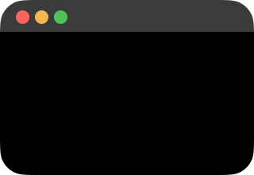
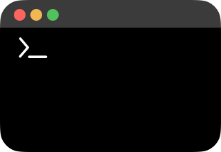

<p align="center">
  
</p>

<p align="center">
  <h1 align="center">MILO</h1>
  <p align="center"><strong>🐾 Your tiny, floating, terminal-pet coding companion.</strong></p>
  <p align="center"><em>Reacts to your focus · talks in typewriter text · keeps you on track — all offline, all local, all privacy-first.</em></p>
</p>

<p align="center">
  
  
  
  
  
</p>

---

## ✨ What is MILO?

MILO is a **tiny floating desktop pet** that lives on your screen while you code. It blinks, follows your cursor with its pupils, reacts to your typing intensity, and speaks in **terminal-style typewriter bubbles**.

MILO has a **context-aware brain** — it knows how long you've been focused, what language you're coding in, which project you're working on, whether you need a break, and even that it's 2 AM and you should probably sleep.

All of this happens **locally on your Mac**. No cloud. No login. No telemetry. Just a small friend on your desktop.

---

## 🧠 Smart Personality

MILO comes with **three response modes**:

| Mode | Description |
|---|---|
| 🎲 **Classic Local** | Simple random roasts & encouragements — playful but not context-aware. |
| 🧩 **Smart Local** | **176 context-aware response templates** with anti-repetition, mood detection, weighted random selection, and token substitution (`{project}`, `{language}`, `{focusMinutes}`). |
| ✨ **Smart Personality** | Optional **Apple Intelligence** enhancement layer. Sanitized coding metadata (never code/text) is sent to Foundation Models for truly personal, contextual responses. |

---

## 🎬 Terminal-Style Bubbles

<p align="center">
  
</p>

MILO's response bubbles look like a **tiny terminal window**:

```
● ● ● milo.term
> Already 42 minutes in MILO. The bugs are sweating politely. █
```

- **Typewriter animation** — characters appear one-by-one at ~26ms/char
- **Blinking cursor** — underline `_` or block `█`, configurable
- **Monospaced green text** on dark background with red/yellow/green dots
- Todo & Reminder bubbles also use terminal styling for message text

---

## 🎯 Features at a Glance

<table>
<tr>
<td width="50%">

### 🐾 Companion
- Floating, borderless, draggable pet
- **Pupil tracking** — eyes follow your cursor globally (30fps)
- **Mood animations** — idle, typing, happy, sleepy, focus, confused
- **Blink engine** — procedural blinking with varied timing
- **Terminal typewriter bubbles** with blinking cursor
- **Click to chat** — context-aware reactions

</td>
<td width="50%">

### ⏱️ Productivity
- **Pomodoro timer** — 25/5, 50/10, 90/15 presets
- Timer badge floating below MILO
- **Local reminders** — NL parser, notifications, snooze, reschedule
- **Local todos** — overdue detection, quick-add, reminders integration
- **Break nudge system** — MILO tells you to stretch
- **Typing reactions** — intensity-aware bubble responses

</td>
</tr>
<tr>
<td width="50%">

### 📊 Coding Metrics
- Tracks active coding time (5-sec tick)
- Detects editor — Xcode, VS Code, Cursor, Terminal, JetBrains…
- Estimates top language from file extensions
- **Git LOC tracking** — added/deleted/net from `git diff --numstat` + `git log`
- Uses **security-scoped bookmarks** for sandboxed Git access
- Ignores `node_modules`, `.git`, `build`, `dist`, `DerivedData`, etc.
- Optional WakaTime enrichment (read-only, Keychain-stored API key)

</td>
<td width="50%">

### 🔒 Privacy
- **Zero cloud / zero telemetry / zero login**
- Keyboard activity: **timing & intensity only** — never reads characters
- Git LOC from **summary stats only** — never reads source code
- WakaTime API key in **macOS Keychain** (not UserDefaults)
- Smart Personality: **only coding metadata** — never typed text, files, clipboard
- All data stays on your Mac — **100% local-first**

</td>
</tr>
</table>

---

## 🧬 Response Engine Architecture

```
┌─────────────────┐
│  CodingContext   │  ← focus min, typing intensity, project, language, todo count...
└────────┬────────┘
         ▼
┌─────────────────┐
│  MiloMoodDetector│  ← idle? focused? overworked? celebrating?
└────────┬────────┘
         ▼
┌─────────────────────┐
│  MiloResponseIntent  │  ← event + context + mood → intent (encourage/roast/break/...)
│  Planner             │
└────────┬────────────┘
         ▼
┌─────────────────────┐
│  MiloResponseComposer│  ← 176 templates × weighted random × anti-repeat
│  (Smart Local)       │
└────────┬────────────┘
         ▼
┌─────────────────────┐
│  MiloSmartPersonality│  ← optional Apple Intelligence layer
│  Engine (AI opt-in)  │     safety-filtered, rate-limited, privacy-gated
└────────┬────────────┘
         ▼
┌─────────────────────┐
│  MiloTerminalTextView│  ← typewriter animation + blinking cursor
│  (Terminal Bubble)   │
└─────────────────────┘
```

---

## 🖥️ Controls

### Menu Bar
MILO lives in your macOS menu bar — quick access to everything:

| Item | Action |
|---|---|
| `Show/Hide Milo` | Toggle the floating companion |
| `Start Pomodoro ▸` | 25/5, 50/10, 90/15 |
| `Add Reminder` | Quick entry window |
| `Chat Reminder` | Natural-language input ("buat todo update README besok jam 10") |
| `Add Todo` | Quick todo entry |
| `Open Todos` | Full todo list with done/edit/delete |
| `Coding Metrics` | Dashboard with LOC, language, project stats |
| `Settings` | Full settings — General, Personality, Sound, Pomodoro, Privacy… |

### Right-Click MILO
Right-click the floating pet for the same quick-access menu — no need to reach the menu bar.

### Badges
Two compact badges hover below MILO when active:
- **🍅 Pomodoro badge** — live countdown timer
- **📊 Coding Metrics badge** — coding time today + top language + net LOC

---

## 🏗️ Project Structure

```
Milo/
├── Milo.xcodeproj
├── README.md
├── script/build_and_run.sh
└── Milo/
    ├── App/
    │   ├── Application/
    │   │   ├── AppDelegate.swift              # Composition root, service wiring
    │   │   ├── MainApp.swift                  # @main entry
    │   │   ├── MenuBarController.swift        # NSStatusItem & menu
    │   │   └── MiloWindowController.swift     # Floating panel, overlays, response pipeline
    │   └── Core/
    │       ├── Persistence/
    │       │   ├── MiloLocalStorageService.swift
    │       │   ├── MiloStorageKeys.swift
    │       │   └── KeychainService.swift
    │       └── Services/
    │           └── MiloMumbleEngine.swift
    │
    ├── Features/
    │   ├── CodingMetrics/         # Editor detection, Git LOC, language estimation
    │   ├── Companion/
    │   │   ├── Animations/        # Per-mood animation configs (idle/typing/happy/sleepy/focus)
    │   │   ├── Blink/             # Procedural blink engine
    │   │   ├── Character/         # Body, eyes, pupils, mouth, layout constants
    │   │   ├── Models/            # Mood, reaction lines, animation state
    │   │   ├── Services/          # State store, keyboard activity, typing bubble
    │   │   ├── Overlays/          # Bubble coordinators, window controllers, badges
    │   │   ├── ResponseEngine/    # 🆕 Context-aware response pipeline
    │   │   │   ├── Models/        #   CodingContext, Mood, Intent, Event, Template, History
    │   │   │   ├── Engine/        #   MoodDetector, IntentPlanner, Composer (176 templates)
    │   │   │   ├── AI/            #   Smart Personality: prompt builder, safety filter, rate limiter
    │   │   │   ├── Integration/   #   CodingContextProvider
    │   │   │   └── Debug/         #   Response debug logger
    │   │   └── Views/            # Root view, floating pet, home view
    │   ├── MouseTracking/         # Global mouse position service (30fps)
    │   ├── Pomodoro/              # Timer, sound, break nudge, badge
    │   ├── Reminder/              # CRUD, scheduler, NL parser, notifications, history
    │   ├── Settings/              # Full settings: General, Personality, Sound, Pomodoro...
    │   │   └── Views/Personality/ # 🆕 Smart Personality settings UI
    │   ├── Todo/                  # CRUD, scheduler, command parser
    │   ├── FileWatcher/           # FSEvents project monitoring
    │   └── Chat/                  # NL reminder/todo input
    │
    └── UI/
        ├── Assets.xcassets/
        │   └── MiloAsset/         # Body, eyes, pupils, mouth, command line, app icon
        └── Components/
            └── Bubbles/           # Terminal bubble views, cursor styles
```

---

## 🔧 Architecture Notes

### AppKit Shell + SwiftUI Content
MILO uses **AppKit for window management** and **SwiftUI for all content**:

- **`FloatingPetPanel`** — `NSPanel` subclass: borderless, non-activating, floating level, all-spaces, clear background
- **`DraggableHostingView`** — `NSHostingView` subclass with custom `hitTest` for click-through transparency
- **Overlay windows** — separate `NSWindow` per badge/bubble, positioned relative to character via `MiloOverlayCoordinator`

### Dependency Injection
All services created in `AppDelegate.applicationDidFinishLaunching` — explicit constructor injection. No `@EnvironmentObject` magic.

### Concurrency
- All services annotated `@MainActor`
- Timer-based loops: `Task { while !isCancelled }` pattern
- Git LOC: security-scoped bookmark access with `Process.execute()`
- Smart Personality AI: `async/await` with `withThrowingTaskGroup` timeout

### Data Storage
| Backend | Used For |
|---|---|
| `MiloLocalStorageService` (JSON → UserDefaults) | Reminders, todos, Pomodoro, coding metrics |
| `@AppStorage` | User toggles (eye follow, typing reaction, sounds, badges) |
| `KeychainService` (macOS Keychain) | WakaTime API key |
| `MiloPersonalitySettingsStore` | Response mode, tone, privacy toggles |

---

## 🚀 Build & Run

### Prerequisites
- macOS 26.5+
- Xcode 26+ (Swift 5.0)

```bash
git clone https://github.com/hendrairawan/Milo.git
cd Milo
bash script/build_and_run.sh

# Or open in Xcode
open Milo.xcodeproj
```

### CLI Build

```bash
xcodebuild \
  -project Milo.xcodeproj \
  -scheme Milo \
  -destination 'platform=macOS,arch=arm64' \
  build
```

---

## 🔒 Privacy

MILO is **local-first by design**. Here's what it stores vs what it never touches:

| ✅ Stored Locally | ❌ Never Stored / Read |
|---|---|
| Keyboard activity **timing & intensity** | Typed characters, key values, key history |
| Active app name & bundle ID | Source code contents |
| File extensions (for language estimation) | File contents |
| Git `diff --numstat` summaries (added/deleted counts) | Git source diffs or code |
| User-configured project folder paths | Clipboard content |
| Pomodoro sessions & stats | Any data to cloud |
| Reminders & todos | Telemetry or analytics |
| WakaTime API key (Keychain) | WakaTime API key (UserDefaults) |

> **Smart Personality** sends only sanitized coding metadata (focus minutes, typing intensity, language, Pomodoro state, todo counts) — never typed text, source code, file paths, passwords, or clipboard. Project name is hidden by default (opt-in).

---

## 🗺️ Roadmap

### ✅ Done
- [x] Floating desktop pet with global cursor tracking
- [x] Mood animations & procedural blink engine
- [x] Pomodoro timer with presets & badge
- [x] Local reminders (NL parser, notifications, snooze, reschedule)
- [x] Local todos (overdue detection, chat input, reminders integration)
- [x] Global keyboard activity detection (listener-only, no key logging)
- [x] Coding metrics — local + WakaTime enrichment
- [x] Git LOC tracking with security-scoped bookmarks
- [x] File watcher with FSEvents for real-time project activity
- [x] **Context-aware response engine** — 176 templates, mood detection, anti-repeat
- [x] **Terminal-style typewriter bubbles** — monospaced green text, blinking cursor
- [x] **Smart Personality AI** — optional Apple Intelligence enhancement with privacy gating
- [x] **Separate overlay windows** — badges & bubbles don't block clicks
- [x] **Priority-based bubble coordinator** — anti-overlap, token hide timers, cooldowns

### 🚧 Planned
- [ ] Weekly coding summary dashboard
- [ ] SQLite migration for larger local storage
- [ ] Richer sound effects & animation states
- [ ] Agent integrations (Cline, Copilot status indicators)
- [ ] Mood check-ins & wellness nudge system
- [ ] Custom template editor for power users

---

## 🎨 Design Principles

> **Stay tiny. Stay ambient. Never steal focus. Keep it playful.**

- **Tiny & Ambient** — 160×110 pixels of floating companion, not a full window
- **Never Steals Focus** — `nonActivatingPanel`, click-through transparency, no modal dialogs
- **Local-First** — everything on your Mac, zero network for core features
- **Playful, Not Noisy** — reactions are quick, cute, skippable, never annoying
- **Privacy as a Feature** — no login, no cloud, no telemetry, no tracking

---

## 📝 License

MIT — see [LICENSE](LICENSE) file.

---

<p align="center">
  <sub>Made with ☕️ for developers who code solo.</sub>
  <br>
  <sub>🧠 Smart Personality · 🖥️ Terminal Bubbles · 🔒 Privacy-First</sub>
</p>
